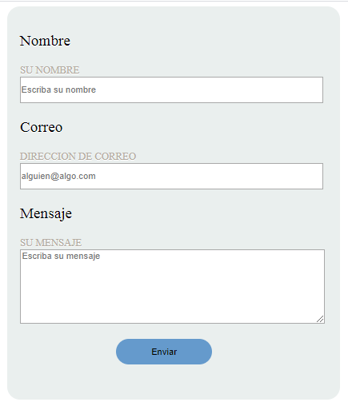
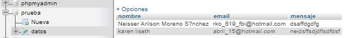

# Formulario Web ( HTML, CSS y MySQL)

Este Formulario es básico, pero funciona correctamente guardando sus datos en una Base de Datos creada con phpMyAdmin. Lo hice más que todo para entender como funciona y como trabaja una página Web con una base de Datos, lo que realmente importa al menos para mi en este caso es la conexión con la BD, ya que es en PHP en la última version.

## Requerimientos no Funcionales :

* Visual Studio Code  ( Puedes usar cualquier editor de código).
* XAMMP: Servicio del modulo MySQL
* XAMMP: Servicio del modulo Apache
* Apache XAMPP

### Captura del Formulario :

### Captura de la Base de Datos :

> Esto lo hice de un tutorial, pero le apliqué mis toques, saludos!

Apoya o visita mi perfil de Ko-fi para más ayuda :heart_eyes: :heart:

